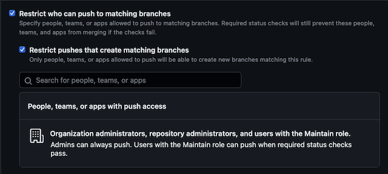

# FKT

FLuxCD Kind of Templater

[](https://github.com/clingclangclick/fkt/actions/workflows/release.yml)

## Usage

```shell
Usage: fkt

FluxCD Kind of Templater.

Flags:
  -h, --help                         Show context-sensitive help.
  -f, --config-file="config.yaml"    YAML configuration file ($CONFIG_FILE)
  -b, --base-directory="."           Sources and overlays base directory ($BASE_DIRECTORY)
  -d, --dry-run                      Validate and return error if changes are needed ($DRY_RUN)
  -l, --logging.level="info"         Log level ($LOG_LEVEL)
  -o, --logging.file=STRING          Log file ($LOG_FILE)
  -t, --logging.type="console"       Log format ($LOG_FORMAT)
```

### Example

``` yaml
---
settings:
  directories:
    sources: sources         # path containing sources
    overlays: overlays       # path to place templated files
  delimiters:
    left: '[[['              # custom left delimiter
    right: ']]]'             # custom right delimiter
  log:
    level: debug             # log level, one of none, trace, debug, info, warn, error. Default is none
    format: json             # log format, one of console, json. Default is console
    file: 'log.txt'          # log file, none infers stdout
values:                      # global values
  global_key: global_value
  global_array_keys:
    - global_array_key: global_array_value
    - global_array_property:
        global_array_property_key: global_array_property_value
  global_slices:
    - global_slice_one
    - global_slice_two
clusters:
  - platform: platform        # cluster platform, freeform provider, templated as `Cluster.platform`
    name: cluster             # cluster name, templated as `Cluster.name`
    region: region            # cluster region, templated as `Cluster.region`
    environment: environment  # cluster environment, templated as `Cluster.environment`
    managed: true             # prune cluster output directory, manage top-level kustomize.yaml file
    values:                   # cluster level values, supercedes global values
      cluster_inline_folded: >
        Several lines of text,
        with some "quotes" of various 'types',
        and also a blank line:

        and some text with
          extra indentation
          on the next line,
        plus another line at the end.


      cluster_inline_literal: |
        Several lines of text,
        with some "quotes" of various 'types',
        and also a blank line:

        and some text with
          extra indentation
        on the next line,
        plus another line at the end.


      cluster_inline_single_quoted: 'Several lines of text,
        ·containing ''''single quotes''''. Escapes (like \n) don''''t do anything.

        Newlines can be added by leaving a blank line.
          Leading whitespace on lines is ignored.'
      cluster_key: cluster_value
      cluster_array_keys:
        - cluster_array_slice: cluster_array_value
      cluster_slices:
        - cluster_slice_one
        - cluster_slice_two
    sources:                  # sources to include for cluster
      example:                # source path within `directories.sources`
        origin: ex            # overlay origin name, default is source path, accessed as `.Source.origin`
        managed: true         # managed source, will not remove overlay if cluster is managed and source non-existent
        namespace: example    # optional namespace, default to `default`, accessed as `.Source.namespace`
        values:               # values, overrides cluster and global leval, accessed as `.Values.<map name>`
          data: test-date     #  `.Values.data`
```

With a `sources/example/cm.yaml` file

```yaml
apiVersion: v1
kind: ConfigMap
metadata:
  name: [[[ .Source.name ]]]
data:
  value: [[[ .Values.data ]]]
```

## Cluster paths

Overlay cluster paths are in the form:
`<platform>/<region>/<environment>/<name>`

A managed cluster resets the cluster directory when ran, EXCEPT if source is unmanaged,
i.e. `source.Managed` is `false`. In this case, the unmanaged source path for the cluster
is:

* Not removed
* If a `kustomization.yaml` or `kustomization.yml` exists, the cluster `kustomization.yaml`
  will include the unmanaged source.

This functionality exists to bootstrap FluxCD in a cluster.

## Values

Values are accessed as `.Values.<property>`
Properties are replaced if a lower-level setting updates the property. Values are not merged.

Evaluation order:

* Global
* Cluster
* Source

### Sprig templating functions

Templating uses [sprig](http://masterminds.github.io/sprig/) functions.

For example, values as:

```yaml
array_keys:
  - array_slice: array_value
```

Templated as:

```yaml
keys: "[[[ keys .Values | join "," ]]]"
array_keys: [[[ first .Values.array_keys | values | first ]]]
```

Become:

```yaml
keys: "cluster_array_keys"
array_keys: cluster_array_value
```

### YAML multiline values

YAML [multiline string](https://yaml-multiline.info/) values are supported, 
but due to templating quotes may need doubled.

For example, values as:

```yaml
inline_folded: >
  Several lines of text,
  with some "quotes" of various 'types',
  and also a blank line:

  and some text with
    extra indentation
    on the next line,
  plus another line at the end.


inline_literal: |
  Several lines of text,
  with some "quotes" of various 'types',
  and also a blank line:

  and some text with
    extra indentation
  on the next line,
  plus another line at the end.


inline_single_quoted: 'Several lines of text,
  ·containing ''''single quotes''''. Escapes (like \n) don''''t do anything.

  Newlines can be added by leaving a blank line.
    Leading whitespace on lines is ignored.'
```

Templated as:

```yaml
inline_folded: >[[[ nindent 4 .Values.cluster_inline_folded ]]]
inline_literal: |[[[ nindent 4 .Values.cluster_inline_literal ]]]
inline_single_quoted: '[[[ indent 4 .Values.cluster_inline_single_quoted | trim ]]]'
```


Become:

```yaml
inline_folded: >
  Several lines of text, with some "quotes" of various 'types', and also a blank line:
  and some text with
    extra indentation
    on the next line,
  plus another line at the end.
  
inline_literal: |
  Several lines of text,
  with some "quotes" of various 'types',
  and also a blank line:
  
  and some text with
    extra indentation
  on the next line,
  plus another line at the end.
  
inline_single_quoted: 'Several lines of text, ·containing ''single quotes''. Escapes (like \n) don''t do anything.
  Newlines can be added by leaving a blank line. Leading whitespace on lines is ignored.'
```

### Global values

Global valuse are in the upper-level schema.

### Cluster values

Access as `.Cluster.<property>`

Properties:

* `platform`
* `region`
* `environment`
* `name`

### Source values

Access as `.Source.<property>`

Properties:

* `name`: Source name
* `namespace`: Source namespace
* `origin`: Source origin, allows for re-using sources

## Bootstrapping FluxCD

Include a `flux-system` anchor in the YAML configuration

```yaml
  flux-system: &flux-system
    flux-system:
      managed: false
```

Add the anchor to the cluster sources property:

```yaml
    sources:
      <<: [*flux-system]
```

After running `fkt`, no upper-level Kustomization will exist in the cluster path.
It is safe to commit this configuration into the config repo.

In the config repo, bootstrap fluxcd into the cluster path. FluxCD will install on the cluster and
update the repository to include a `flux-system` path in the cluster overlay. Pull the changes, as Flux
may have altered the default branch. Running `fkt` again will add the `flux-system` Kustomizations
to the cluster Kustomization.

## YAML spec

### Config type

```golang
type Config struct {
	Settings      *Settings `yaml:"settings"`
	Values        Values    `yaml:"values,flow"`
	Clusters      []Cluster `yaml:"clusters"`
}
```

### Settings type

```golang
type Settings struct {
	Delimiters struct {
		Left  string `yaml:"left"`
		Right string `yaml:"right"`
	} `yaml:"delimiters"`
	Directories struct {
		Sources       string `yaml:"sources"`
		Overlays      string `yaml:"overlays"`
		BaseDirectory string `yaml:"base_directory"`
	} `yaml:"directories"`
	DryRun    bool       `yaml:"dry_run"`
	LogConfig *LogConfig `yaml:"log"`
}
```

#### LogConfig type

```golang
type LogConfig struct {
	Level  LogLevel `yaml:"level"`  // One of none (panic), trace, debug, info, error
	File   string   `yaml:"file"`   // Default stdout
  Format string   `yaml:"format"` // One of console, json. Default console
}
```

### Cluster type

```golang
type Cluster struct {
  Platform    string             `yaml:"platform"`
  Name        string             `yaml:"name"`
  Region      string             `yaml:"region"`
  Environment string             `yaml:"environment"`
  Managed     bool               `yaml:"managed"`
  Values      Values             `yaml:"values,flow"`
  Sources     map[string]*Source `yaml:"sources"`
}
```

### Source type

```golang
type Source struct {
  Path      *string `yaml:"path"`
  Namespace *string `yaml:"namespace"`
  Values    Values  `yaml:"values,flow"`
  Managed   *bool   `yaml:"managed"`
}
```

## Pre-Commit config

A pre-commit config can be used to automatically update the cluster overlays
after changing the configuration.

```yaml
- repo: git@<repo>
  rev: <tag>
  hooks:
  - id: fkt
    always_run: true
    args: [-l, debug]
```

## GitHub action

A GitHub `action.yml` is included to verify that the supplied configuration
would be unchanged to ensure the configuration output is consistent with
the overlay contents for all clusters.

Arguments:

* `base-directory`: Default to `.`
* `config-file`: Default to `config.yaml`
* `log-level`: Default to `warn`

### FKT hosted as public repository or Enterprise private repository

```yaml
    - name: Validate Overlay
      uses: <org>/<repo>@v0
```

### FKT hosted as private repository, non-Enterprise

A PAT is required to load the repo into the GH working directory.

```yaml
    - name: Checkout Validate Overlay Action
      uses: actions/checkout@v4
      with:
        repository: <org><repo>
        ref: <version>
        token: ${{ secrets.INTERNAL_PAT }}
        path: ./.github/actions/fkt
    - name: Validate Overlay
      id: validate-overlay
      uses: ./.github/actions/fkt
      with:
        log-level: debug
```

## Automated action and pre-commit hooks update

GitHub action and pre-commit versions can update automatically after image push if
`SSH_DEPLOY_PRIVATE_KEY` secret is set. A `read-write` deployment key is sufficient for this
when branch protection rules are properly set.



### `SSH_DEPLOY_PRIVATE_KEY` Secret and Deploy Key Management

Manage repository deployment key and set the GitHub `SSH_DEPLOY_PRIVATE_KEY` action secret
with the `bin/manage_deploy_key` script.
